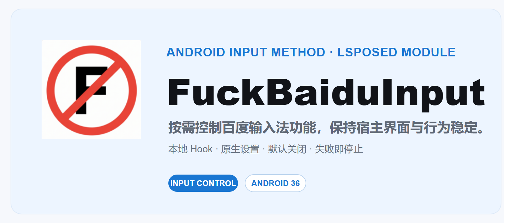

<div align="center">



# FuckBaiduInput

**面向 OPPO 定制版百度输入法的本地 LSPosed 控制模块**

[](https://github.com/TheKingBucket001/FuckBaiduInput/releases/latest)
[](https://github.com/TheKingBucket001/FuckBaiduInput/actions/workflows/release.yml)
[](LICENSE)
[](https://github.com/TheKingBucket001/FuckBaiduInput)

[下载模块](https://github.com/TheKingBucket001/FuckBaiduInput/releases/latest) · [源代码](https://github.com/TheKingBucket001/FuckBaiduInput) · [问题反馈](https://github.com/TheKingBucket001/FuckBaiduInput/issues)

</div>

---

## 项目简介

FuckBaiduInput 将可选的本地 Hook 控制项嵌入 OPPO 定制版百度输入法的原生设置界面。设置使用宿主 COUI Preference 组件，不提供 WebView、独立设置皮肤、常驻服务或联网功能。

所有功能默认关闭。宿主身份不匹配时模块会停止安装业务 Hook，避免将针对特定版本的逻辑作用于未知版本。

## 功能概览

- **剪贴板**：扩展容量、保留长文本与超长记录，并清理内容识别路径。
- **账号与云**：按需控制账号隔离、云备份同步、云优化和云输入入口。
- **推荐与推广**：按需隐藏智慧推荐、场景化推荐、广告 SDK、商店推广和活动推荐。
- **隐私与后台**：按需控制统计上传、问题反馈和后台更新检查。
- **皮肤与表情**：精简在线皮肤、表情商店、字体与远程升级入口；可隐藏表情面板中的斗图页面。
- **界面与工具箱**：按需隐藏搜索、机械键盘、字体设置、AI 写作入口，并支持替换纯净模式左上角 Emoji 图标。

每个分类均有“本组全部启用”开关。关闭功能后，对应 Hook 会回到宿主原有逻辑。

## 兼容性

| 项目 | 当前支持 |
| --- | --- |
| 宿主包名 | `com.baidu.input_oppo` |
| 宿主版本 | `8.5.302.367` |
| versionCode | `7244` |
| 模块环境 | LSPosed / libxposed API 101 |
| 当前发行版 | `v0.8.1` |

其他版本尚未完成适配。模块会校验包名、版本和 APK 身份；校验失败时不会安装业务 Hook。

## 下载模块

- [Latest Release](https://github.com/TheKingBucket001/FuckBaiduInput/releases/latest)
- [全部版本](https://github.com/TheKingBucket001/FuckBaiduInput/releases)

正式发行 APK 由 GitHub Actions 使用仓库 Secrets 临时恢复正式签名并构建。请使用同一正式签名 APK 覆盖更新，不要将本地测试签名包覆盖到正式安装。

## 使用说明

1. 下载并安装正式 APK。
2. 在兼容 libxposed API 101 的 LSPosed 环境中启用模块，作用域仅选择 OPPO 定制版百度输入法。
3. 强行停止并重新启动输入法。
4. 打开输入法设置，在“语言及输入方式设置”上方进入 `🚫 fuckinginput`。
5. 按需开启功能；标注需要重启的功能在切换后重新启动输入法。

## 边界

- `99999` 是剪贴板设置的容量上限，不代表无限容量。
- 本项目不解锁付费、VIP 或服务端权益。
- Hook 仅覆盖已验证的 Java 路径，不承诺覆盖 JNI、动态加载或服务端行为。
- 模块不声明 `INTERNET` 权限，也不创建常驻 Service、Receiver、Job 或定时任务。

## 本地构建

要求：JDK 17、Android SDK Platform 36、Build Tools 36.0.0。

```powershell
.\gradlew.bat :app:assembleDebug :app:lintDebug
```

## 项目链接

| 链接 | 地址 |
| --- | --- |
| 主页 | [TheKingBucket001/FuckBaiduInput](https://github.com/TheKingBucket001/FuckBaiduInput) |
| 下载 | [GitHub Releases](https://github.com/TheKingBucket001/FuckBaiduInput/releases) |
| 问题反馈 | [Issues](https://github.com/TheKingBucket001/FuckBaiduInput/issues) |
| 构建状态 | [GitHub Actions](https://github.com/TheKingBucket001/FuckBaiduInput/actions) |

## 许可证

本项目采用 [GNU General Public License v3.0](LICENSE)。
